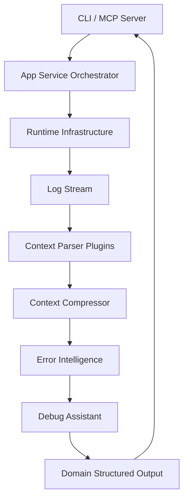

# LogIQ

**LogIQ** is an AI-native command intelligence engine written in Go. It is designed to bridge the gap between human-readable command-line tools and AI coding agents.

LogIQ executes terminal commands, analyzes raw stdout/stderr logs in real-time, extracts structured insights, detects common failures, suggests actionable fixes, and compresses massive logs down into condensed, highly meaningful context blocks perfectly sized for Large Language Models (LLMs).

Integrate LogIQ directly into your AI coding assistants or IDEs to automatically diagnose build failures and understand terminal workflows without passing gigabytes of redundant logs to the AI!

---

## Features

- **Command Execution & Log Streaming:** Instantly runs commands and monitors logs as they execute without memory bottlenecking.
- **Error Intelligence Engine:** Scans thousands of log lines to accurately pinpoint the _root cause_ of a failure instead of just presenting symptoms.
- **AI Debug Assistant:** Automatically generates actionable resolution suggestions tailored to the specific failure using extensible heuristics.
- **Ultra-Compact Context Compression:** Smart filtering and Run-Length Encoding (RLE) deduplication shrinks 10,000 lines of noise purely to semantic signals, reducing AI token consumption by up to 90%.
- **Token Savings Analytics:** Built-in real-time calculation showcasing context size reduction metrics natively.
- **Tee Mode (Raw Fallback Logging):** Automatically archives the full uncompressed raw log when errors happen, enabling AI agents to read the complete context via the `raw_log_path` API if needed.
- **Command Explanation & Diagnostics:** (`explain` / `doctor`) Translates raw semantic strings into explanations and scans local system telemetry.
- **Extensible Plugin System:** Easily inject new environment parsers via modular plugins (.so files).
- **Model Context Protocol (MCP) Server:** Native stdio-based JSON-RPC server ready to converse with Claude Desktop, Cursor, and other MCP-compatible frameworks.

---

## Token Savings

Depending on the ecosystem, LogIQ's contextual compression combined with deduplication routinely drops AI terminal token consumption significantly without losing critical debugging semantic properties:

| Framework / Tool | Raw Log Tokens Avg. | LogIQ Output Tokens | Reduction | Savings Strategy |
| :--- | :--- | :--- | :--- | :--- |
| **Cargo Test / Build** (Rust) | ~15,000 | ~1,500 | **-90%** | Removes dependency downloading noise & long stack trails |
| **Vite / Vue Build** (JS/TS) | ~4,500 | ~450 | **-90%** | Modules compiled deduplication |
| **Flutter Run** (Dart) | ~12,000 | ~1,200 | **-90%** | Device connectivity pooling & RLE |
| **Go Test** (Go) | ~6,000 | ~600 | **-90%** | Hides passing tests; surfaces exact line numbers |
| **Git Status / Diff** | ~3,000 | ~600 | **-80%** | Compact array grouping |
| **NPM Install / Yarn** | ~8,000 | ~80 | **-99%** | Suppresses ASCII loaders completely |

---

## Architecture

LogIQ enforces strict **Clean Architecture and Layered Design** ensuring uncoupled resilience:



1. **Domain Layer:** Pure foundational structures (`domain.StructuredOutput`).
2. **Application Layer:** Isolated core logic orchestrators (`pipeline`, `detector`, `errorintel`, `debugassist`, `ctxengine`).
3. **Infrastructure Layer:** Caching, telemetry plugins, config mapping, and physical command invocation (`runtime`).
4. **Interfaces Layer:** CLI command parsers and MCP HTTP multiplexers.

---

## Repository Structure

```tree
.
├── cmd/logiq/                 # CLI and main entry point for the application
├── internal/
│   ├── domain/               # Pure business interfaces and data models
│   ├── app/                  # Application services orchestrating LogIQ core logic
│   ├── interfaces/           # Delivery adapters (CLI renderers, MCP HTTP server)
│   └── infrastructure/       # External side-effecting code (runtime, plugin, config, observability)
├── plugins/                  # Specialized log parsers for ecosystems (e.g., flutter, vue)
├── docs/                     # Documentation (architecture, workflows)
└── examples/                 # Sample project structures for simulated integrations
```

---

## Installation

You can install LogIQ globally via `go install`:

```bash
go install github.com/rickseven/logiq/cmd/logiq@latest
```

**Build from Source:**

```bash
git clone https://github.com/rickseven/logiq.git
cd logiq
go build -o logiq.exe ./cmd/logiq
```

---

## Quick Start

Execute a command directly. LogIQ will run it natively and analyze the result.

```bash
logiq run npm run build
logiq run flutter test
```

_Example Output (Agent JSON Output)_

```json
{
  "tool": "vue",
  "command": "npm run build",
  "status": "failure",
  "summary": "Vite build failed due to syntax error in App.vue.",
  "metrics": {
    "duration_seconds": 4.1,
    "modules_compiled": 12,
    "original_bytes": 14500,
    "compressed_bytes": 1200,
    "savings_percentage": 91.7
  },
  "error_intel": {
    "root_cause": "SyntaxError: Unexpected token",
    "error_type": "build_error"
  },
  "suggestions": ["Check line 42 in App.vue for missing brackets/commas."],
  "raw_log_path": ".logiq/artifacts/exec-8f23719a-timestamp.log",
  "compressed_context": "..."
}
```

---

## CLI Usage

| Command               | Description                                                     |
| --------------------- | --------------------------------------------------------------- |
| `logiq run <cmd>`     | Execute a system command through the LogIQ pipeline.            |
| `logiq explain <cmd>` | Generate a semantic explanation of what a command does.         |
| `logiq doctor`        | Output system forensic analytics and SDK diagnostics locally.   |
| `logiq trace`         | Return a history buffer of globally captured runtime traces.    |
| `logiq plugins`       | View available parsers loaded dynamically via the plugin infra. |
| `logiq mcp`           | Start the native MCP stdio server for AI IDE integration.       |

---

## MCP Integration

LogIQ acts as a native **Model Context Protocol (MCP)** server using the **stdio** transport, meaning it communicates via standard input/output. This is the industry-standard way to integrate tools with AI agents.

**Start the MCP Server:**

```bash
logiq mcp
```

### Available Tools via MCP

LogIQ implements the full MCP toolset with **Rich Markdown Outputs** for better AI comprehension:

- **`run_command`**: Execute terminal tasks (supports Windows shell built-ins natively). Returns semantic summaries and structured metrics.
- **`analyze_logs`**: Ingests raw log content and applies LogIQ's compression/summarization pipeline.
- **`explain`**: Translates complex command syntax into plain English.
- **`doctor`**: Provides real-time system diagnostics and project health telemetry.

---

## Supported Frameworks

LogIQ supports **20+ intelligent parsers** across multiple ecosystems:

| Ecosystem            | Tools & Frameworks                                                                                               |
| :------------------- | :--------------------------------------------------------------------------------------------------------------- |
| **Web / JS**         | Vite, Vitest, Webpack, Rollup, ESBuild, Next.js, Nuxt.js, Jest, Playwright, Cypress, ESLint, Prettier, Stylelint |
| **Mobile**           | Flutter (Build, Test, Run), Android (**Gradle**)                                                                 |
| **Microsoft / .NET** | **.NET Core, ASP.NET MVC/WebForms**, MSBuild, NuGet                                                              |
| **Backend & Logic**  | Go Test, Python (**Pytest**), Rust (**Cargo**), golangci-lint                                                    |
| **DevOps & Infra**   | **Git Status/Diff**, **DB Migration (Prisma, Drizzle, Sequelize)**, NPM, PNPM, Yarn                              |

---

## Plugin System

The system parses specific tools completely abstracted via decoupled plugins.
Extensions provide logic specifically overriding standard regex behavior.

**Structure:**

```text
plugins/
  ├── vue/        # Vite, Vitest, Nuxt
  ├── flutter/    # Dart, Flutter Build, Widget tests
  ├── dotnet/     # .NET Core, WebForms, MVC, MSBuild
  └── git/        # Git Status and Diff analysis
```

Adding a new tool parser specifically amounts to writing a simple Go module strictly implementing the `domain.Plugin` interface and pushing it cleanly into the `internal/infrastructure/plugin` loader.

---

## Development Guide

We encourage open-source contributions!

### Available Scripts

- **`go build ./...`**: Compiles LogIQ entirely locally validating type safety layers.
- **`go test ./...`**: Runs isolated application tests covering the compression logic natively.

### Adding a new Parser

1. Create a dir in `plugins/<tool_name>/`.
2. Implement your regex capture patterns matching against the `domain.Parser` interface.
3. Call `plugin.Register(<tool>.New())` locally within your primary binary registry scope inside `main.go`.

---

## Roadmap

- 🧠 **Improved Error Intelligence:** Introduce local mini-ML heuristics identifying abstract error codes natively instead of static regex.
- 📡 **Distributed Mode:** Deploy logic servers entirely remotely dispatching containerized runners centrally!
- 🔗 **JetBrains Integration:** Expand beyond VS Code/Cursor to support IntelliJ/WebStorm natively via MCP.

---

## Contributing

1. Fork the LogIQ repository locally.
2. Branch specifically off `main` for your feature `git checkout -b feature/amazing-idea`.
3. Commit cleanly formatting strictly adhering to `gofmt`.
4. Open a highly descriptive PR outlining the new domain capabilities natively!

---

## License

MIT License. See `LICENSE` for exact telemetry bindings.
